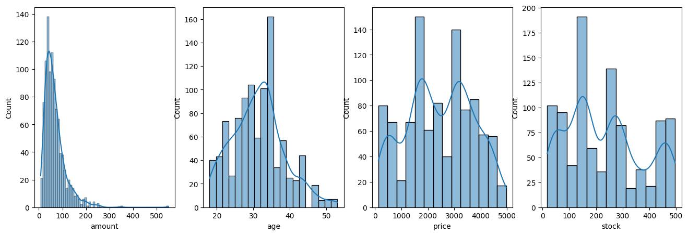

# 🛍️ Customer Purchase Behavior Analyzer

📊 End-to-end data pipeline that merges multi-source retail data and prepares it for behavioral analysis.


---

## 🎥 Video Walkthrough

> 🔗 _[Google Drive link — coming soon]_

---

## 📌 Overview

This project builds a clean, analysis-ready dataset from three raw sources — **SQL**, **JSON**, and **CSV** — simulating a real-world retail data environment. It covers the full pipeline from ingestion to feature-ready output.

## 🧩 Data Sources

| Source | Format | Content |
|---|---|---|
| 🗄️ `inventory.db` | SQLite | Product catalog |
| 🧾 `sales.json` | JSON | Transaction records |
| 👤 `users.csv` | CSV | Customer profiles |

## ⚙️ Pipeline

1. 🔗 **Load & Merge** — combine SQL, JSON, and CSV sources into a single dataframe
2. 🧹 **Clean** — validate and handle missing values
3. 📈 **Outlier Handling** — IQR-based filtering on numeric fields
4. 🔄 **Transform** — date parsing, feature extraction, Yeo-Johnson power transform
5. 🏷️ **Encode** — one-hot encoding for categorical variables
6. 📏 **Scale** — StandardScaler & MinMaxScaler comparison
7. 🔍 **Profile** — automated EDA report via `ydata-profiling`

## 📊 Feature Distributions



*Distribution check on `amount`, `age`, `price`, and `stock` prior to outlier handling.*

## 🛠️ Tech Stack

`Python` · `Pandas` · `NumPy` · `Scikit-learn` · `Seaborn` · `Matplotlib` · `ydata-profiling` · `SQLite`

## 🚀 Getting Started

```bash
pip install pandas numpy scikit-learn seaborn matplotlib ydata-profiling
```

Place `inventory.db`, `sales.json`, and `users.csv` inside a `dataset/` folder, then run the notebook.

## 📂 Project Structure

```
├── dataset/
│   ├── inventory.db
│   ├── sales.json
│   └── users.csv
├── distribution.png
└── Customer_Purchase_Behavior_Analyzer.ipynb
```

---

✨ *Built as part of a data analytics portfolio project.*
